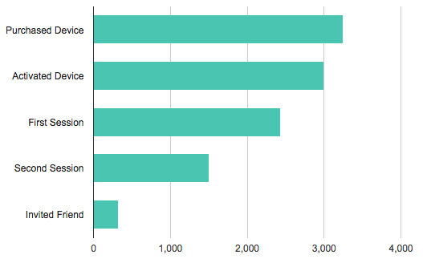

# Visualization

## How it works

Building charts from queries is easier than ever.

Clients have a #draw method with accepts a query, a DOM selector, and a configuration object as arguments. You can call this directly on the client, which will execute a request and visualize its response, like so:

```javascript
client.draw(query, selector, config);
```

## Example usage

```javascript
var query = new Keen.Query("count", {
  eventCollection: "pageviews",
  groupBy: "visitor.geo.country"
  interval: "daily",
  timeframe: "this_21_days"
});
var chart = client.draw(query, document.getElementById("chart-wrapper"), {
  title: "Custom chart title",
  chartType: "columnchart"
});
```

Charts can also be instantiated with the `Keen.Dataviz` object. Learn more about this object [here](./dataviz.md).

```javascript
var chart = new Keen.Dataviz()
  .el(document.getElementById("chart-wrapper"))
  .chartType("columnchart")
  .prepare(); // start spinner

var req = client.run(query, function(err, res){
  if (err) {
    // Display the API error
    chart.error(err.message);
  }
  else {
    // Handle the response
    chart
      .parseRequest(this)
      .title("Custom chart title")
      .render();
  }
});

// Re-run and refresh every 15 minutes...
setInterval(req.refresh, 1000 * 60 * 15);
```

## DOM Selector

The second argument for the `#draw` method is a reference to the DOM element where your chart will appear. This should be a block level element, like a `<div>` tag, referenced by its ID attribute:

`document.getElementById("chart-wrapper")`

## Configuration

```javascript
{
  colors: [ "#ff0000", "#222", "lightblue" ],
  title: "My chart title!",
  height: 400,
  width: 600,
  colorMapping: {},
  labelMapping: {},
  labels: [],
  chartOptions: {
    // pass directly through to underying vizz library
  }
}
```

### Customized Labels

`labelMapping`: object that selectively replaces previous values with desired values:

```javascript
labelMapping: {
  "https://yourdomain.com/": "Home",
  "https://yourdomain.com/gallery.html": "Gallery"
}
```

`labels`: array that totally replaces all values (useful for funnels):

```javascript
{
  labels: [
    "Step 1",
    "Step 2 (75%)",
    "Step 3 (50%)",
    "Step 4 (12%)"
  ]
}
```

### Customized Colors

`colorMapping`: object that corresponds labels (key) with desired colors (value).

```javascript
colorMapping: {
  "Home": "#ff0000",
  "Gallery": "purple"
}
```

### Customized Chart Instance

`chartOptions`: config object passed to the underlying visualization library (Google Charts).

```javascript
chartOptions: {
  isStacked: true,
  legend: { position: "none" },
  bar: {
    groupWidth: "90%"
  }
}
```

### Selective Chart types

`chartType`: string identifying the type of chart to render:

  * [areachart](#area-chart)
  * [barchart](#bar-chart)
  * [columnchart](#column-chart)
  * [linechart](#line-chart)
  * [metric](#metric)
  * [piechart](#pie-chart)
  * [table](#table)


## Chart Type Examples

Area, bar, column and line charts all operate on the same underlying query/response type: numeric values on an interval. So, the demos for these chart types will all utilize the following query, but will specify their own respective `chartType` property.

```javascript
var total_pageviews = new Keen.Query("count", {
  eventCollection: "pageviews",
  groupBy: "channel",
  timeframe: "this_3_days",
  interval: "daily"
});
```

### Area Chart


```javascript
client.draw(total_pageviews, document.getElementById("total-daily-revenue-areachart"), {
  chartType: "areachart",
  title: "Daily revenue (7 days)",
  chartOptions: {
    isStacked: true
  }
});
```

```
<div id="total-daily-revenue-areachart"></div>
```
Find additional configuration options for area charts [here](https://developers.google.com/chart/interactive/docs/gallery/areachart#Configuration_Options).

### Bar Chart


```javascript
client.draw(total_pageviews, document.getElementById("total-daily-revenue-barchart"), {
  chartType: "barchart",
  title: "Daily revenue (7 days)",
  chartOptions: {
    isStacked: true
  }
});
```

```
<div id="total-daily-revenue-barchart"></div>
```
Find additional configuration options for bar charts [here](https://developers.google.com/chart/interactive/docs/gallery/barchart#Configuration_Options).


### Column Chart


```javascript
client.draw(total_pageviews, document.getElementById("total-daily-revenue-columnchart"), {
  chartType: "columnchart",
  title: "Daily revenue (7 days)",
  chartOptions: {
    isStacked: true
  }
});
```

```html
<div id="total-daily-revenue-columnchart"></div>
```
Find additional configuration options for column charts [here](https://developers.google.com/chart/interactive/docs/gallery/columnchart#Configuration_Options).


### Line Chart


```javascript
client.draw(total_pageviews, document.getElementById("total-daily-revenue-linechart"), {
  chartType: "linechart",
  title: "Daily revenue (7 days)"
});
```

```html
<div id="total-daily-revenue-linechart"></div>
```
Find additional configuration options for line charts [here](https://developers.google.com/chart/interactive/docs/gallery/linechart#Configuration_Options).


### Metric


Visualize single numeric query responses, such as a count, sum, average, etc.

```javascript
var count = new Keen.Query("count", {
  eventCollection: "pageviews"
});
client.draw(count, document.getElementById("count-pageviews-metric"), {
  chartType: "metric",
  title: "Page Views",
  colors: ["#49c5b1"]
});
```

```html
<div id="count-pageviews-metric"></div>
```

**Additional options**

* `chartOptions.prefix`: string to prepend to the beginning of the result value
* `chartOptions.suffix`: string to append to the end of the result value
* `chartOptions.prettyNumber`: use short syntax to render numbers (eg: 300k), enabled by default


### Pie Chart


Pie charts can render `groupBy` queries that do not include an interval.

```javascript
var visitor_origins = new Keen.Query("count", {
  eventCollection: "pageviews",
  groupBy: "referrer"
});
client.draw(visitor_origins, document.getElementById("count-pageviews-piechart"), {
  chartType: "piechart",
  title: "Visitor Referrers"
});
```
```hmtl
<div id="count-pageviews-piechart"></div>
```

### Table

Tables can render any query response, including extractions.

```javascript
var all = new Keen.Query("extraction", {
  eventCollection: "pageviews",
  timeframe: "this_7_days"
});
client.draw(all, document.getElementById("extract-pageviews-table"), {
  chartType: "table",
  title: "All page view data"
});
```

```html
<div id="extract-pageviews-table"></div>
```
Find additional configuration options for tables [here](https://developers.google.com/chart/interactive/docs/gallery/table#Configuration_Options).

### Funnels

[Funnels](https://keen.io/docs/data-analysis/funnels/) are a fancy analysis type that allow you to see what percentage of users (or devices) complete various steps.




```javascript
var watch_activation_funnel = new Keen.Query("funnel", {
  steps: [
    {
       event_collection: "purchases",
       actor_property: "user.id",
       filters: [
          {
            "property_name" : "product",
            "operator" : "eq",
            "property_value" : "telekinetic watch"
          }
       ],
       timeframe: "last_7_days"
    },
    {
      event_collection: "activations", // how many activated the device?
      actor_property: "user.id",
      optional: true
    },
    {
      event_collection: "sessions", // how many had a session?
      actor_property: "user.id",
      optional: true
    },
    {
      event_collection: "sessions",
      actor_property: "user.id",
      filters: [
          {
            "property_name" : "lifetime_session_count",
            "operator" : "gt",
            "property_value" : 1 // how many had more than 1 session
          }
       ],
       optional: true
    },
    {
      event_collection: "send_invitations",
      actor_property: "user.id"
    }
  ]
});

client.draw(watch_activation_funnel, document.getElementById("chart-05"), {
  library: "google",
  chartType: "barchart", // or "columnchart"
  height: 340,
  title: null,
  colors: ["#79CDCD"],
  labelMapping: [ "Purchased Device", "Activated Device", "First Session", "Second Session", "Invited Friend" ],
  chartOptions: {
    chartArea: { height: "85%", left: "20%", top: "5%" },
    legend: { position: "none" }
  }
});
```


## Pass in your own data to charts

To display a modified query result or data from another source into a visualization, pass a result object and a div to Keen.Dataviz. The [Keen IO API docs](https://keen.io/docs/data-analysis/) describe what the results look like for all the different query types (counts, series, funnels, etc).

Here's an example that takes a hard-coded value "1896" and draws it as a number.

```javascript
  var chart = new Keen.Dataviz()
    .el(document.getElementById('my-div'))
    .parseRawData({ result: 1896 })
    .chartType("metric")
    .colors(["#6ab975"])
    .title("Wow!")
    .width(400)
    .render();
```

## Combine results of two queries

Here's an example that runs two queries, divides them, and then outputs the results:

```javascript

  var sessions_count = new Keen.Query("count_unique", {
    eventCollection: "screen_view", // Use this collection because there is at least 1 screenview per session
    targetProperty: "session.id",
    timeframe: "last_7_days"
  });

  var paid_sessions_count = new Keen.Query("count_unique", { // Find number of sessions with payments
    eventCollection: "payment",
    targetProperty: "session.id",
    timeframe: "last_7_days"
  });

  var chart = Keen.Dataviz()
    .el(document.getElementById("paid-session-conversion"))
    .colors(["#6ab975"])
    .title("Conversion %")
    .width(400)
    .prepare(); // start spinner

  // Send query to Keen IO
  var mashup = client.run([sessions_count, paid_sessions_count], function(err, res){
    if (err) {
      // Display the API error
      chart.error(err.message);
    }
    else {
      // divide paid sessions by sessions to get conversion rate
      chart
        .parseRawData({
          result: (res[1].result/res[0].result).toFixed(2) * 100
        })
        .render();
    }
  });

```

## Combine two line charts

Here's an example that takes the data from two different line charts and plots them both onto the same graph.


```javascript
// use a variable to ensure timeframe & interval for both queries match
var interval = "daily"
var timeframe = "last_30_days"

var pageviews = new Keen.Query("count", { // first query
	eventCollection: "pageviews",
	interval: interval,
	timeframe: timeframe
});

var uniqueVisitors = new Keen.Query("count_unique", { // second query
	eventCollection: "pageviews",
	targetProperty: "uuid",
	interval: interval,
	timeframe: timeframe
});

var chart = new Keen.Dataviz()
  .el(document.getElementById("visitors-uniques"))
  .chartType("linechart")
  .chartOptions({
    hAxis: {
      format:'MMM d',
      gridlines:  {count: 12}
    }
  })
  .prepare();

client.run([pageviews, uniqueVisitors], function(err, res){ // run the queries

	var result1 = res[0].result  // data from first query
	var result2 = res[1].result  // data from second query
	var data = []  // place for combined results
	var i=0

	while (i < result1.length) {

		data[i]={ // format the data so it can be charted
			timeframe: result1[i]["timeframe"],
			value: [
				{ category: "Pageviews", result: result1[i]["value"] },
				{ category: "Visitors", result: result2[i]["value"] }
			]
		}
		if (i == result1.length-1) { // chart the data
      chart
        .parseRawData({ result: data })
        .render();
		}
		i++;
	}
});
```
